## 使用 Mermaid 进行文本绘图之时序图


### 一、什么是文本绘图

文本绘图是通过使用纯文本或简单的文本语法来描述图形、图表或其他可视化元素的一种方法。相对于传统的图形绘图工具，文本绘图更注重使用易读的文本表示图形结构和关系，而无需直接操作图形工具。

文本绘图通常使用一种特定的文本语法或标记语言，用户通过编写简单的文本代码来定义图形的结构、元素之间的关系以及其他视觉属性。这种方法的一个优势是用户无需手动绘制复杂的图形，只需使用简单的文本描述即可生成图表。

一些流行的文本绘图工具和语言包括：

1. **Graphviz：** 使用 DOT 语言描述图形，支持绘制各种图表，如有向图、无向图等。

2. **Mermaid：** 使用简单的文本语法来描述流程图、时序图、甘特图等，支持与 Markdown 集成。

3. **PlantUML：** 使用类似于 UML 的语法描述图形，支持绘制类图、时序图、用例图等。

4. **Ascii art：** 使用纯文本字符来绘制简单的图形，如表情符号画的笑脸、树形结构等。

5. **TikZ：** 一个 LaTeX 的图形绘制工具，通过 LaTeX 文本描述图形。

这些工具提供了一种使用文本来创建图形的方式，适用于多种场景，包括软件文档、流程图、时序图、架构图等。文本绘图的优势之一是它在版本控制、文档化和共享方面具有便利性，同时允许用户专注于图形的结构和关系，而不必过多考虑图形编辑器的细节。


举例：

```
+--------+                               +---------------+
|        |--(A)- Authorization Request ->|   Resource    |
|        |                               |     Owner     |
|        |<-(B)-- Authorization Grant ---|               |
|        |                               +---------------+
|        |
|        |                               +---------------+
|        |--(C)-- Authorization Grant -->| Authorization |
| Client |                               |     Server    |
|        |<-(D)----- Access Token -------|               |
|        |                               +---------------+
|        |
|        |                               +---------------+
|        |--(E)----- Access Token ------>|    Resource   |
|        |                               |     Server    |
|        |<-(F)--- Protected Resource ---|               |
+--------+                               +---------------+
```


### 二、文本绘图的优势

文本绘图有一些优势和用途，使其在特定场景下成为一种有价值的选择。以下是一些理由：

1. **简便易用：** 文本绘图通常使用简单的文本语法，相对于手动绘制图形或使用图形绘图工具，学习曲线更加平缓。这使得它成为快速创建图表和图形的有效方式。

2. **版本控制和文档化：** 文本绘图的代码可以轻松地嵌入在版本控制系统中，这使得对图表进行跟踪、比较和恢复成为可能。此外，文本形式的图表可以直接嵌入文档中，使得文档与图表保持同步，更容易进行维护和更新。

3. **易于分享和传播：** 文本绘图的代码通常较为紧凑，易于分享和传播。你可以将文本图表的代码粘贴在电子邮件、聊天消息、Markdown 文件等各种场景中，而不需要附加大型图像文件。

4. **与文本编辑器集成：** 文本图表通常可以与文本编辑器（如VS Code、Sublime Text等）集成，通过代码高亮和自动完成等功能，提供更好的编辑体验。

5. **自动化生成：** 通过文本描述图表，可以更容易实现图表的自动生成。这对于需要频繁更新或根据数据动态生成图表的情况非常有用。

6. **跨平台兼容性：** 文本图表通常不依赖于特定的图形绘图工具或平台，因此在不同的操作系统和环境中都可以很好地工作。

7. **流程图、时序图等领域需求：** 在软件开发、系统设计等领域，流程图、时序图等图表往往更容易通过文本来描述，以清晰地表达不同步骤之间的关系和顺序。

总体而言，文本绘图提供了一种简便、灵活、可维护的方式来创建和分享图表，适用于许多场景，特别是需要频繁更新和版本控制的情况。


### 三、Mermaid 文本绘图

- 官网：https://mermaid.js.org/

- 介绍：https://mermaid.js.org/intro/

- Live Editor：https://mermaid.live/
- 命令行工具 mermaid-cli on GitHub：https://github.com/mermaid-js/mermaid-cli
- Mermaid Live Editor 视频教程：http://mermaid.js.org/config/Tutorials.html
- 使用 API：http://mermaid.js.org/config/usage.html

简明教程及介绍

- 使用 Typora 画图（类图、流程图、时序图）：https://zhuanlan.zhihu.com/p/172635547
- Typora 画流程图、时序图(顺序图)、甘特图：https://www.runoob.com/note/47651

Mermaid 是一个用于创建流程图、时序图、甘特图等各种图表的轻量级的 JavaScript 绘图库。它使用简单的文本语法来描述图表结构，用户无需手动绘制图形，只需使用文本描述图形的关系和结构即可。

Mermaid 的主要特点包括：

1. **简单易用的文本语法：** Mermaid 使用直观的文本语法，使得用户可以轻松地创建各种图表，而无需深入了解复杂的图形描述语法。

2. **支持多种图表类型：** Mermaid 不仅支持流程图和时序图，还支持甘特图、类图、状态图等多种图表类型，使其成为一个多功能的图表工具。

3. **与 Markdown 和 HTML 集成：** Mermaid 可以与 Markdown 和 HTML 集成，方便在文档中嵌入图表。

4. **支持在线渲染：** Mermaid 可以在浏览器中直接渲染图表，也可以在服务端渲染，使得用户可以在不同的环境中使用。

5. **开源：** Mermaid 是开源项目，用户可以自由使用、修改和分发，同时社区活跃，提供了丰富的文档和示例。

由于其简便易用的特性，Mermaid 成为了许多开发者、文档作者和项目管理者的选择，用于创建清晰可视化的图表，以便更好地理解和传达信息。


### 四、使用 Mermaid 绘制时序图

简单样例：

```
sequenceDiagram
    Alice->>John: Hi，帅锅！
    John-->>Alice: 你怎么知道我帅？
    Alice-)John: 看着就帅！
    John--)Alice: 花痴！
```


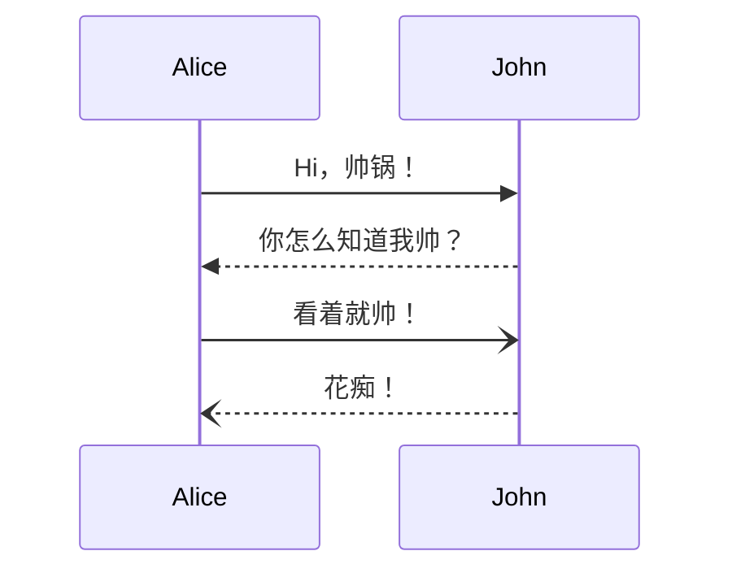


#### （一）Syntax（语法）

参考：http://mermaid.js.org/syntax/sequenceDiagram.html#syntax

`%%` 开头用作注释

##### 1、[Participants](https://mermaid.js.org/syntax/sequenceDiagram.html#participants)（参与者）、[Actors](https://mermaid.js.org/syntax/sequenceDiagram.html#actors)（行为人）、[Aliases](https://mermaid.js.org/syntax/sequenceDiagram.html#aliases)（别名）

```
sequenceDiagram
    actor U as User
    participant N as Nginx
    participant T as Tomcat
    U ->> N : 使用手机访问
    N ->> T : 向后台转发请求
    T -->> N : 后台返回
    N -->> U : 将后台返回的数据返回给用户
```


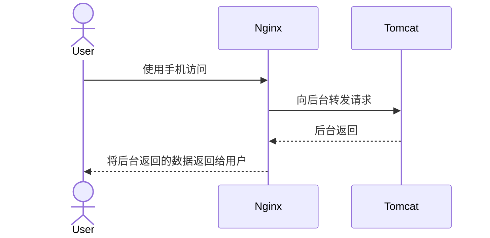

##### 2、[Grouping / Box](https://mermaid.js.org/syntax/sequenceDiagram.html#grouping-box)（分组 / 装箱）

```
    sequenceDiagram
    box Yellow Alice & John
    participant A
    participant J
    end
    box Another Group
    participant B
    participant C
    end
    A->>J: Hello John, how are you?
    J->>A: Great!
    A->>B: Hello Bob, how is Charly?
    B->>C: Hello Charly, how are you?
```


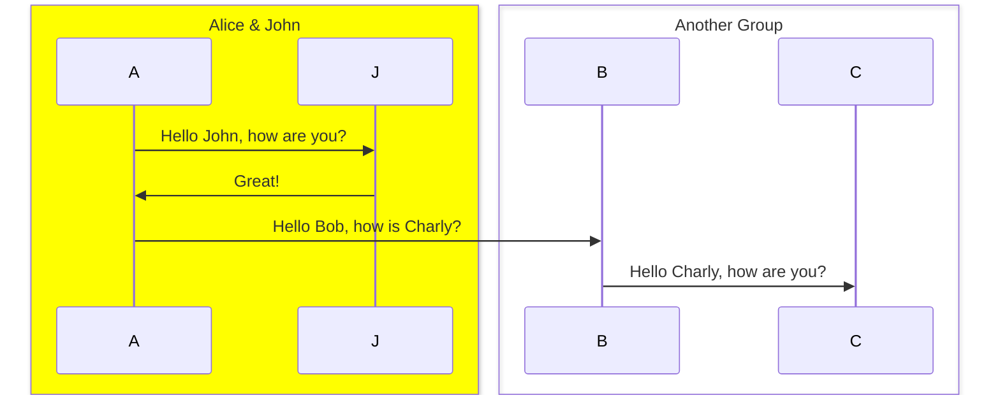


#### （二）[Messages](https://mermaid.js.org/syntax/sequenceDiagram.html#messages)（消息）

消息可以用实线或虚线显示两种形式。

```
[参与者][箭头][参与者]:消息文本
```

目前支持六种箭头类型：

| 类型   | 描述                         |
| :----- | :--------------------------- |
| `->`   | 无箭头的实线                 |
| `-->`  | 无箭头的虚线                 |
| `->>`  | 带箭头的实线                 |
| `-->>` | 带箭头的虚线                 |
| `-x`   | 实线末端带十字架             |
| `--x`  | 虚线末端带十字架             |
| `-)`   | 实线末端带有开放箭头（异步） |
| `--)`  | 虚线末端带有开放箭头（异步） |
```
sequenceDiagram
    A -> B: 无箭头的实线
    A --> B: 无箭头的虚线
    A ->> B: 带箭头的实线
    A -->> B: 带箭头的虚线
    A -x B: 实线末端带十字架
    A --x B: 虚线末端带十字架
    A -) B: 实线末端带有开放箭头（异步）
    A --) B: 虚线末端带有开放箭头（异步）
```


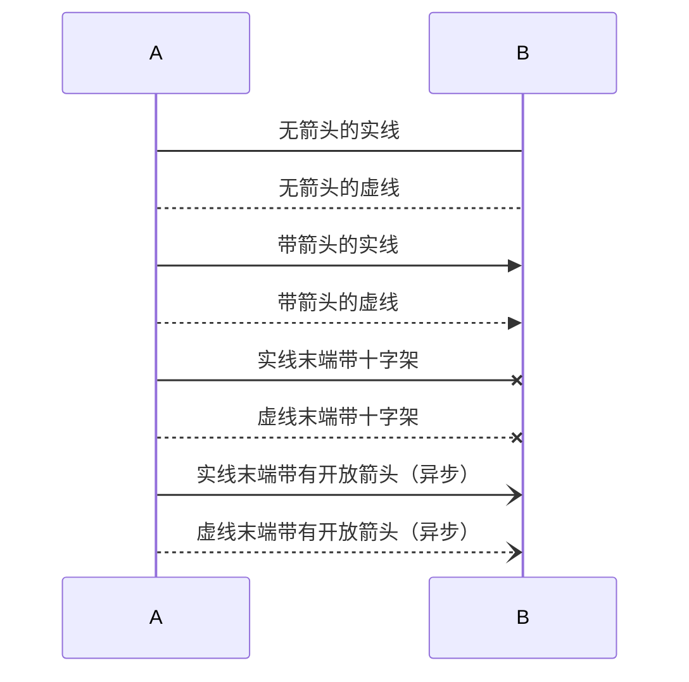


#### （三）[Activations](https://mermaid.js.org/syntax/sequenceDiagram.html#activations)（激活）

```
sequenceDiagram
    Alice->>John: Hello John, how are you?
    activate John
    John-->>Alice: Great!
    deactivate John
```
快捷写法：
```
sequenceDiagram
    Alice->>+John: Hello John, how are you?
    John-->>-Alice: Great!
```


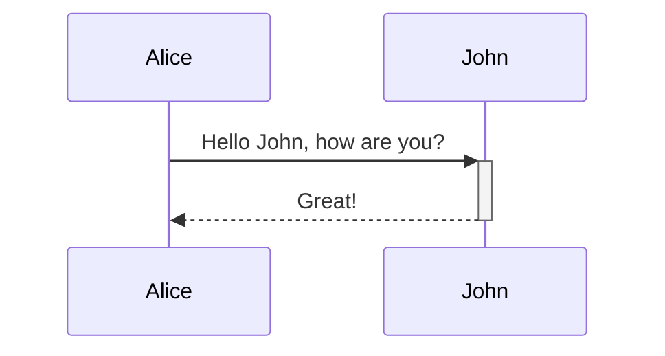

#### （四）[Note](https://mermaid.js.org/syntax/sequenceDiagram.html#notes)（注解）

模式：`right of` | `left of` | `over`

换行：`<br>`

1、`right of`

```
sequenceDiagram
    participant John
    Note right of John: Text in note
```

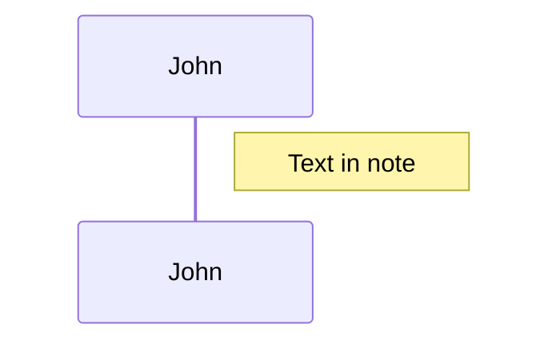

2、`over`

```
sequenceDiagram
    Alice->John: Hello John, how are you?
    Note over Alice,John: A typical interaction<br/>But now in two lines
```

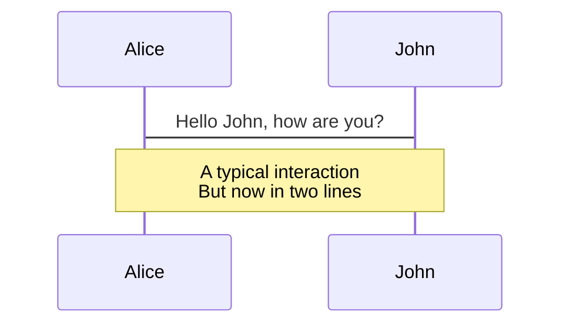

#### （五）[Loops](https://mermaid.js.org/syntax/sequenceDiagram.html#loops)（循环）

```
sequenceDiagram
    Client->Server: 建立连接
    loop 每分钟
        Client->>Server: 健康检查
        Server-->>Client: 检查结果
    end
```

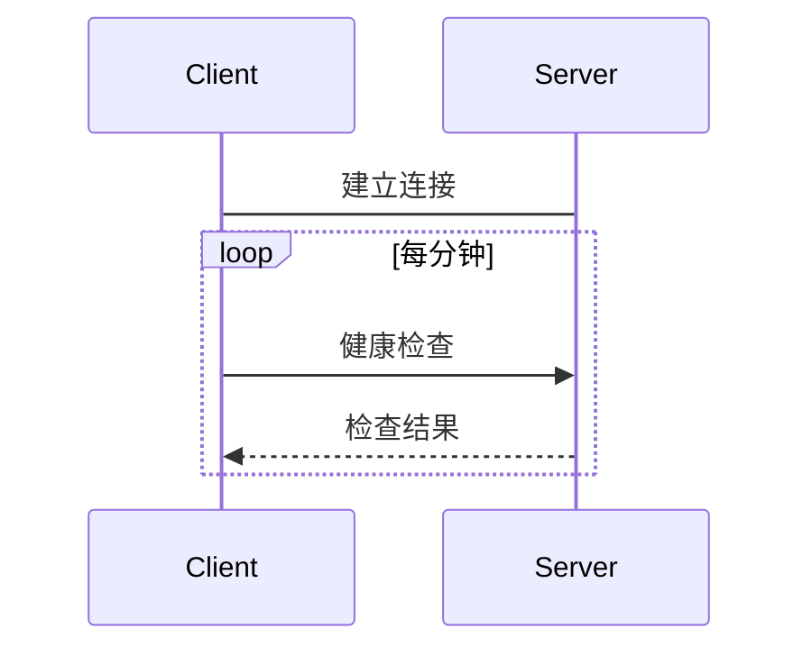

#### （六）[Alt](https://mermaid.js.org/syntax/sequenceDiagram.html#alt)（替代）

`alt` 与 `opt` 区别：

`alt`：条件分支

`opt`：可选操作

```
sequenceDiagram
    Alice->>Bob: 我要请假
    alt 不多于 1 天
        Bob-->>Alice: 批准
    else 多于 1 天
        Bob-->>Alice: 需要领导审批
    end
    opt 可选
        Bob->>Alice: 还有其他事情不？
        Alice-->>Bob: 没事儿了
    end
```

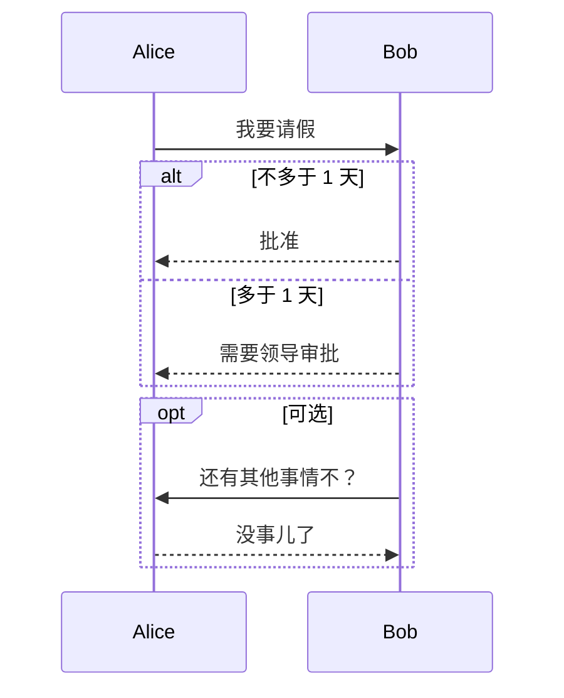

#### （七）[Parallel](https://mermaid.js.org/syntax/sequenceDiagram.html#parallel)（并行）

```
sequenceDiagram
    par 获取 系统A 的待办数量
        待办统计者->>系统 A: 系统 A 有多少待办？
    and 获取 系统B 的待办数量
        待办统计者->>系统 B: 系统 B 有多少待办？
    end
    系统 A-->>待办统计者: 5 条
    系统 B-->>待办统计者: 10 条
```


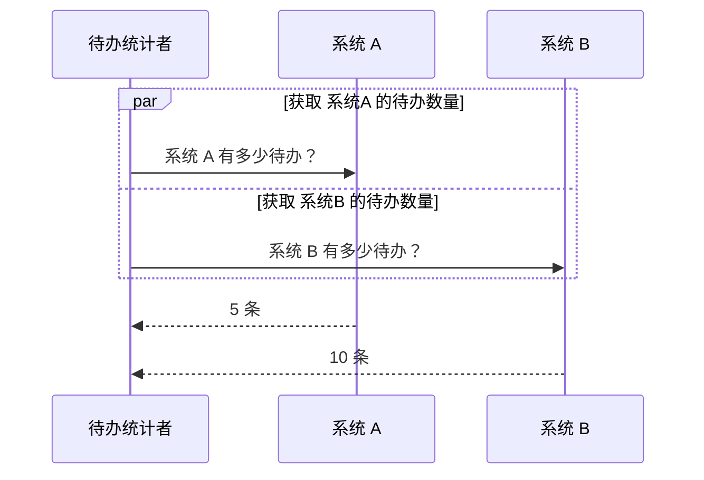


#### （八）[Critical Region](https://mermaid.js.org/syntax/sequenceDiagram.html#critical-region)

使用 `option`：

```
sequenceDiagram
    critical Establish a connection to the DB
        Service-->DB: connect
    option Network timeout
        Service-->Service: Log error
    option Credentials rejected
        Service-->Service: Log different error
    end
```


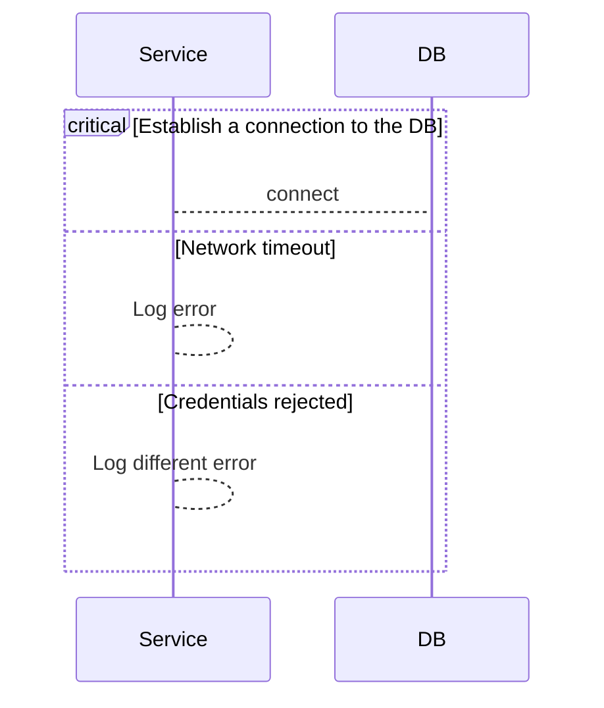

不使用 `option`：

```
sequenceDiagram
    critical Establish a connection to the DB
        Service-->DB: connect
    end
```


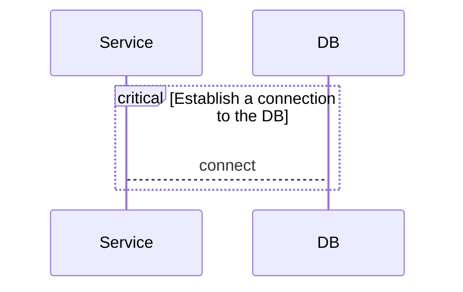


#### （九）[Break](https://mermaid.js.org/syntax/sequenceDiagram.html#break)

```
sequenceDiagram
    客人->>服务员: 点硬磕菜，这菜可以有！
    服务员->>大师傅: 大师傅给做一个呗？
    大师傅-->>服务员: 臣妾做不到啊！
    break 大师傅不会做
        服务员-->>客人: 这菜真没有
    end
    服务员->>管理系统: 下单入账
```


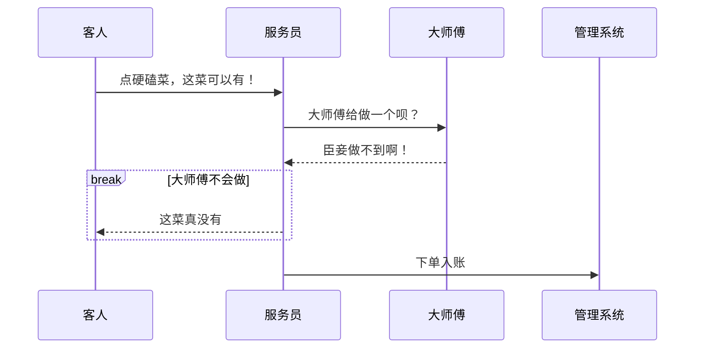

#### （十）[Background Highlighting](https://mermaid.js.org/syntax/sequenceDiagram.html#background-highlighting)（背景高亮）

```
sequenceDiagram
    participant Alice
    participant John

    rect rgb(191, 223, 255)
    note right of Alice: Alice calls John.
    Alice->>+John: Hello John, how are you?
    rect rgb(200, 150, 255)
    Alice->>+John: John, can you hear me?
    John-->>-Alice: Hi Alice, I can hear you!
    end
    John-->>-Alice: I feel great!
    end
    Alice ->>+ John: Did you want to go to the game tonight?
    John -->>- Alice: Yeah! See you there.
```

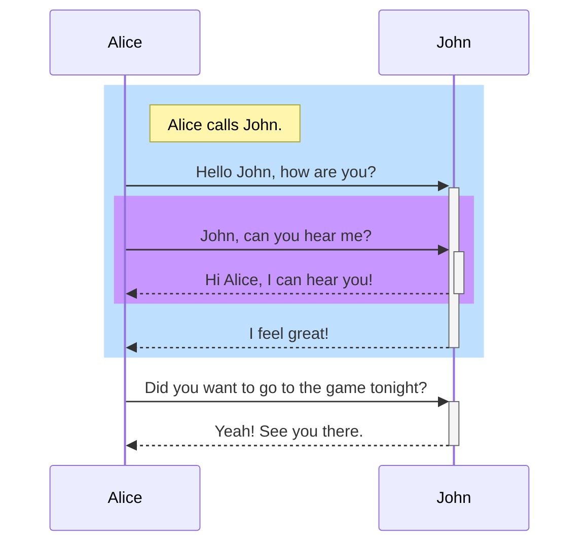


